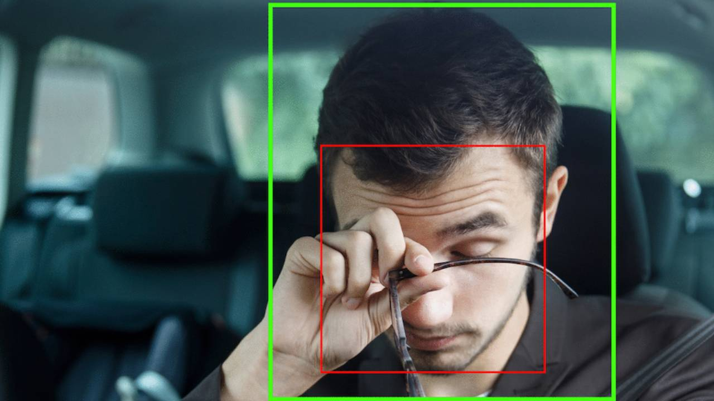

# Drowsiness Detection System Using YOLOv8

This project presents an automated **Drowsiness Detection System** built using **YOLOv8**, a cutting-edge real-time object detection model. The goal of this system is to monitor drivers in real-time and detect early signs of drowsiness by analyzing facial features, particularly the eyes and head posture.

## 🔑 Key Features

- **Real-time detection** of drowsiness indicators such as eye closure and head tilt.  
- **YOLOv8-based model** trained on annotated facial image datasets for high accuracy and speed.  
- Suitable for integration in **vehicles, security systems**, and **workplace safety applications**.  
- **Lightweight and efficient** – optimized for performance on edge devices.

## ⚙️ How It Works

1. The camera captures live video of the driver’s face.
2. YOLOv8 detects key facial features and analyzes them for signs of fatigue (e.g., prolonged eye closure).
3. If drowsiness is detected, the system can trigger alerts or safety mechanisms.

## ❓ Why This Project?

Drowsy driving is one of the leading causes of road accidents. This system aims to reduce accidents by providing a fast and reliable method to detect and alert users when signs of drowsiness are observed.
